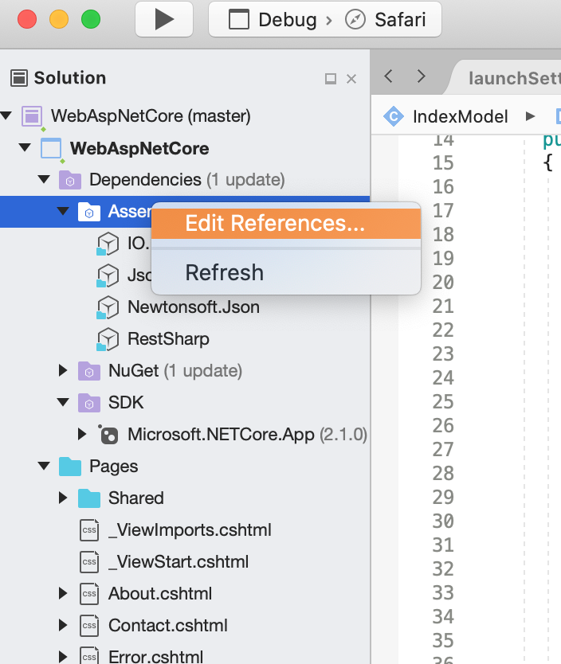

# IO.Deliveree - the C# library for the Deliveree SDK

With Deliveree SDK, developers can integrate our on-demand local delivery platform into their applications. The SDK is designed for developers to check prices, book an immediate or scheduled delivery and follow updates until delivery completion.

- SDK version: 1.0.0

<a name="frameworks-supported"></a>
## Frameworks supported
- .NET 4.5 or later
- .NET CORE 2.1.13 or later

<a name="dependencies"></a>
## Dependencies
- [RestSharp](https://www.nuget.org/packages/RestSharp) - 105.1.0 or later
- [Json.NET](https://www.nuget.org/packages/Newtonsoft.Json/) - 7.0.0 or later
- [JsonSubTypes](https://www.nuget.org/packages/JsonSubTypes/) - 1.2.0 or later

## Should be required for .Net core console application
- [SystemSecurityPermission] Install-Package System.Security.Permissions -Version 4.6.0

## Config for sample project 
    # Add SDK in your project 
        Project/edit References...
        Then browse to Deliveree sdk files:
            - IO.Deliveree.dll
            - JsonSubtype.dll
            - Newtonsoft.Json.dll
            - RestSharp.dll

<p align='center'>            
    </img>
</p>


## Getting Started

## Cancel Booking
```csharp
using System;
using System.Diagnostics;
using IO.Deliveree.Api;
using IO.Deliveree.Client;
using IO.Deliveree.Model;

namespace Example
{
    public class Example
    {
        public void main()
        {
            // Configure API key authorization: ApiKeyAuth
            Configuration.Default.ApiKey.Add("Authorization", "YOUR_API_KEY");
            // Uncomment below to setup prefix (e.g. Bearer) for API key, if needed
            // Configuration.Default.ApiKeyPrefix.Add("Authorization", "Bearer");

            var apiInstance = new DelivereeApi();
            var id = 56;  // int? | ID of delivery
            var acceptLanguage = acceptLanguage_example;  // string |  (optional) 

            try
            {
                apiInstance.CancelBooking(id, acceptLanguage);
            }
            catch (Exception e)
            {
                Debug.Print("Exception when calling DelivereeApi.CancelBooking: " + e.Message );
            }
        }
    }
}
```

## Getting Add Booking
```csharp
using System;
using System.Diagnostics;
using IO.Deliveree.Api;
using IO.Deliveree.Client;
using IO.Deliveree.Model;

namespace Example
{
    public class Example
    {
        public void main()
        {
            // Configure API key authorization: ApiKeyAuth
            Configuration.Default.ApiKey.Add("Authorization", "YOUR_API_KEY");
            // Uncomment below to setup prefix (e.g. Bearer) for API key, if needed
            // Configuration.Default.ApiKeyPrefix.Add("Authorization", "Bearer");

            var apiInstance = new DelivereeApi();
            var acceptLanguage = acceptLanguage_example;  // string |  (optional) 
            Delivery body = new Delivery{
                // Add Deliveries body 
                Locations = new List<Location>{
                    // Add you Location
                }
            }
            try
            {
                //object result = apiInstance.DeliveriesPost(body, acceptLanguage);
                //Task<object> result = apiInstance.DeliveriesPostAsync(body, acceptLanguage);
                //Task<ApiResponse<Object>> result = apiInstance.DeliveriesPostAsyncWithHttpInfo(body,acceptLanguage)

                ApiResponse<Object> result = apiInstance.DeliveriesPostWithHttpInfo(body, acceptLanguage);
            }
            catch (Exception e)
            {
                Debug.Print("Exception when calling DeliveriesPostWithHttpInfo: " + e.Message );
            }
        }
    }
}
```


## GetQuotes
```csharp
using System;
using System.Diagnostics;
using IO.Deliveree.Api;
using IO.Deliveree.Client;
using IO.Deliveree.Model;

namespace Example
{
    public class Example
    {
        public void main()
        {
            // Configure API key authorization: ApiKeyAuth
            Configuration.Default.ApiKey.Add("Authorization", "YOUR_API_KEY");
            // Uncomment below to setup prefix (e.g. Bearer) for API key, if needed
            // Configuration.Default.ApiKeyPrefix.Add("Authorization", "Bearer");

            var apiInstance = new DelivereeApi();
            var acceptLanguage = acceptLanguage_example;  // string |  (optional) 
            var body = new Quote
                {
                    TimeType = "now", // now or schedule
                    Locations = new List<Location>
                {
                    new Location
                    {
                    // location
                    }
                }
                };

            try
            {
                ApiResponse<object> result = apiInstance.DeliveriesGetQuotePostWithHttpInfo(body);
            }
            catch (Exception e)
            {
                Debug.Print("Exception when calling DeliveriesGetQuotePostWithHttpInfo: " + e.Message );
            }
        }
    }
}
```

<a name="documentation-for-api-endpoints"></a>
## Documentation for API Endpoints

All URIs are relative to *https://api.sandbox.deliveree.com/public_api/v1*

Class | Method | HTTP request | Description
------------ | ------------- | ------------- | -------------
*DelivereeApi* | [**CancelBooking**](docs/DelivereeApi.md#cancelbooking) | **POST** /deliveries/{id}/cancel | 
*DelivereeApi* | [**DeliveriesGetQuotePost**](docs/DelivereeApi.md#deliveriesgetquotepost) | **POST** /deliveries/get_quote | 
*DelivereeApi* | [**DeliveriesPost**](docs/DelivereeApi.md#deliveriespost) | **POST** /deliveries | 

<a name="documentation-for-models"></a>
## Documentation for Models

 - [Model.Delivery](docs/Delivery.md)
 - [Model.Location](docs/Location.md)
 - [Model.PositionTracking](docs/PositionTracking.md)
 - [Model.Quote](docs/Quote.md)

<a name="documentation-for-authorization"></a>
## Documentation for Authorization

<a name="ApiKeyAuth"></a>
### ApiKeyAuth

- **Type**: API key
- **API key parameter name**: Authorization
- **acceptLanguage**: HTTP header - optional

